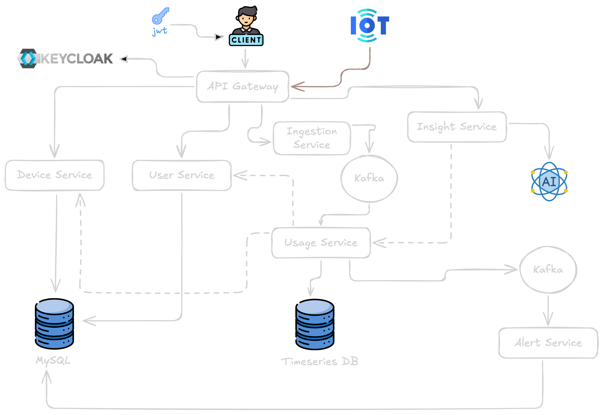
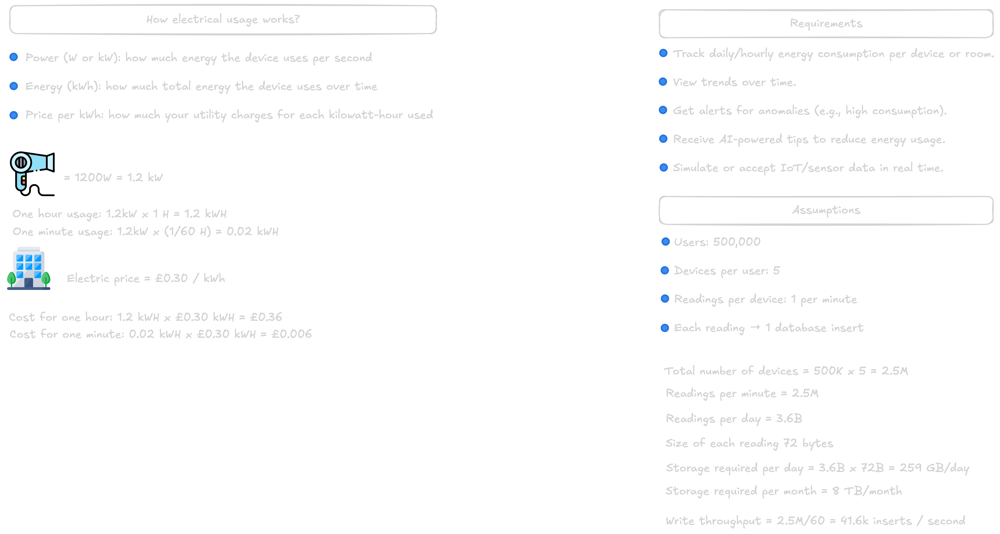

# Home Energy Tracker

[](https://openjdk.org/)
[](https://spring.io/projects/spring-boot)
[](https://spring.io/projects/spring-cloud)
[](https://kafka.apache.org/)
[](https://www.influxdata.com/)
[](https://docs.docker.com/compose/)
[](https://prometheus.io/)
[](https://grafana.com/)

A **production-grade microservices system** for real-time household energy monitoring. Ingests device readings at **~191 msg/s**, processes them through a **3-stage Kafka pipeline**, persists to **InfluxDB**, classifies **WARNING/CRITICAL** alerts via 1-hour rolling aggregations, and delivers billing projections through **async email** — all observable via **Prometheus + Grafana** with p50 < 1ms, p95 < 6ms end-to-end latency.

---

## Table of Contents

- [Architecture](#architecture)
- [Services](#services)
- [Tech Stack](#tech-stack)
- [Kafka Pipeline](#kafka-pipeline)
- [Observability](#observability)
- [Getting Started](#getting-started)
- [API Reference](#api-reference)
- [Access Points](#access-points)
- [Project Structure](#project-structure)

---

## Architecture

```
┌─────────────────────────────────────────────────────────────────────┐
│                        CLIENT / POSTMAN                             │
└────────────────────────────┬────────────────────────────────────────┘
                             │ HTTP
                             ▼
┌─────────────────────────────────────────────────────────────────────┐
│                    API GATEWAY  :9000                               │
│         Spring Cloud Gateway · Circuit Breaker (Resilience4j)      │
│               OAuth2 Resource Server (Keycloak JWT)                │
└───┬──────────────┬───────────────┬──────────────┬───────────────────┘
    │              │               │              │
    ▼              ▼               ▼              ▼
┌────────┐   ┌──────────┐   ┌──────────┐   ┌──────────┐
│  user  │   │  device  │   │ingestion │   │ insight  │
│ :8080  │   │  :8081   │   │  :8082   │   │  :8085   │
└────┬───┘   └────┬─────┘   └────┬─────┘   └──────────┘
     │            │              │
     ▼            ▼              │ Kafka Producer
┌─────────────────────┐         │ topic: energy-usage
│     PostgreSQL      │         │ (5 partitions, KRaft)
│  home_energy_tracker│         ▼
└─────────────────────┘  ┌─────────────────────────────┐
                         │      usage-service :8083     │
                         │  Kafka Consumer (3 threads)  │
                         │  Non-blocking InfluxDB write │
                         │  Scheduled 1hr Flux query    │
                         │  WARNING/CRITICAL classifier │
                         └──────┬──────────┬────────────┘
                                │          │
                                ▼          ▼
                         ┌──────────┐  Kafka Producer
                         │ InfluxDB │  topic: energy-alerts
                         │  :8072   │  (5 partitions)
                         └──────────┘      │
                                           ▼
                                ┌─────────────────────┐
                                │  alert-service :8084 │
                                │  Kafka Consumer      │
                                │  5 concurrent threads│
                                │  Async email (SMTP)  │
                                └──────────┬───────────┘
                                           │
                                           ▼
                                    ┌─────────────┐
                                    │   Mailpit   │
                                    │   :8025     │
                                    └─────────────┘
```

### Architecture Diagrams

| Diagram | Preview |
|---------|---------|
| Full Microservices Flow |  |
| Circuit Breaker (API Gateway) |  |
| Network Separation |  |
| Observability Stack |  |
| Background & Requirements |  |

---

## Services

| Service | Port | Responsibility |
|---------|------|----------------|
| **api-gateway** | `9000` | Single entry point — routing, circuit breaking, JWT validation |
| **user-service** | `8080` | User accounts, alerting preferences, energy thresholds |
| **device-service** | `8081` | Device registry — CRUD for smart meters and plugs |
| **ingestion-service** | `8082` | Accept energy readings via HTTP, produce to Kafka `energy-usage` |
| **usage-service** | `8083` | Consume readings → write to InfluxDB → aggregate → produce alerts |
| **alert-service** | `8084` | Consume alerts → send WARNING/CRITICAL email with billing projection |
| **insight-service** | `8085` | AI-powered usage insights via Spring AI + Ollama (optional) |
| **complaint-service** | `8086` | Complaint management with parallel S3 multi-file upload (AWS Mumbai) |

---

## Tech Stack

| Category | Technology |
|----------|-----------|
| Language | Java 21 |
| Framework | Spring Boot 4.0 (all services), Spring Boot 3.5 (insight-service) |
| Messaging | Apache Kafka (KRaft mode, no ZooKeeper) |
| Time-series DB | InfluxDB 2.x (Flux query language) |
| Relational DB | PostgreSQL (users, devices, alerts) |
| Cloud Storage | AWS S3 (ap-south-1) — complaint file uploads |
| API Gateway | Spring Cloud Gateway Server WebMVC + Resilience4j |
| Security | Keycloak (OAuth2/JWT), Spring Security OAuth2 Resource Server |
| Observability | Micrometer + Prometheus + Grafana (3 dashboards, 19 alert rules) |
| Email (dev) | Mailpit (SMTP trap) |
| Containerization | Docker + Docker Compose |
| Build | Maven (per-service `mvnw` wrapper) |
| AI/ML | Spring AI + Ollama (insight-service) |

---

## Kafka Pipeline

The core data flow is a **3-stage Kafka pipeline** running in **KRaft mode** (no ZooKeeper):

```
ingestion-service                usage-service                alert-service
      │                               │                             │
      │  POST /api/v1/ingestion        │                             │
      │ ──────────────────►           │                             │
      │                               │                             │
      │  produce →  energy-usage      │                             │
      │ ═══════════════════════════►  │                             │
      │         (5 partitions)        │  consume (3 threads)        │
      │         RoundRobin            │  non-blocking InfluxDB write│
      │                               │  scheduled 1hr Flux query   │
      │                               │  threshold classification   │
      │                               │                             │
      │                               │  produce → energy-alerts    │
      │                               │ ════════════════════════►   │
      │                               │      (5 partitions)         │  consume (5 threads)
      │                               │                             │  async email send
      │                               │                             │  DB save (PostgreSQL)
```

### Key Numbers (measured under load)

| Metric | Value |
|--------|-------|
| Peak ingestion rate | ~191 msg/s |
| Partitions per topic | 5 (round-robin) |
| HTTP p50 latency | < 1ms (708µs) |
| HTTP p95 latency | < 6ms (5.9ms) |
| HTTP p99 latency | < 35ms (33ms) |
| Ingestion success rate | 100% |
| usage-service heap (optimized) | 53–90 MiB |
| alert-service heap | 61–101 MiB |
| alert-service consumer threads | 5 concurrent |

### Optimization Applied

Replaced `writeApiBlocking()` with non-blocking batched InfluxDB writes (`batch=1000, flush=1s`), reducing usage-service JVM heap from **1.75 GiB → 89 MiB** under sustained load and unlocking full parallel consumption across all 5 partitions.

---

## Observability

Three production-grade Grafana dashboards auto-provisioned on startup:

### 1. Overview Dashboard
- Services online/offline counters
- Total req/s, 5xx error rate, P95 latency (stat panels)
- Service Up/Down status row (green/red per service)
- HTTP request rate by service and status code
- P50/P95/P99 latency trends
- JVM heap used vs max (bar gauge)
- CPU usage per service
- GC pause time
- HikariCP connection pool (active/idle/pending)
- Top 10 busiest endpoints table
- Top 10 slowest endpoints (P95) table

### 2. Service Health Dashboard
- Service dropdown filter (per-service deep dive)
- Request rate by method (GET/POST/PUT/DELETE)
- 4xx and 5xx error breakdown by endpoint
- Latency heatmap (p50/p95/p99 per service)
- JVM heap vs non-heap, buffer pools
- GC collections/min and pause duration
- Thread states (runnable/waiting/blocked)
- HikariCP acquisition time (P95)

### 3. Kafka & Ingestion Pipeline Dashboard
- Ingestion scorecards (total sent, failed, rate, success %, P95)
- Success vs failed message rate graph
- Cumulative messages counter
- Ingestion latency P50/P95/P99
- Usage-service GC pressure and blocked threads
- Alert-service heap (heap used vs max with threshold line)
- All-services request rate comparison
- All-services CPU comparison

### Prometheus Alert Rules (19 rules across 6 groups)

| Group | Rules |
|-------|-------|
| `service-availability` | ServiceDown, ServiceRestartDetected |
| `http-errors` | High5xxRate, Elevated4xxRate, HighP95Latency, CriticalP99Latency, ZeroRequestRate |
| `jvm-memory` | HighHeapUsage (>80%), CriticalHeapUsage (>92%), FrequentGCPauses, LongGCPauseDuration |
| `jvm-threads` | HighBlockedThreadCount, ThreadCountSpike |
| `hikaricp` | ConnectionPoolExhausted, ConnectionPoolCritical, HighAcquisitionTime |
| `ingestion-pipeline` | IngestionStalled, IngestionFailureDetected, HighIngestionFailureRatio |

---

## Getting Started

### Prerequisites

- **JDK 21**
- **Docker** and **Docker Compose**
- **Maven** (optional — each service has `./mvnw`)

### 1. Clone

```bash
git clone https://github.com/zexxitywave/home-energy-tracker.git
cd home-energy-tracker
```

### 2. Start Infrastructure

```bash
docker compose up -d
```

This starts: **Kafka (KRaft)**, **PostgreSQL**, **InfluxDB**, **Mailpit**, **Kafka UI**, **Keycloak**, **Prometheus**, **Grafana**.

Wait ~30 seconds for all containers to be healthy.

### 3. Build Services

```bash
# Build all services
cd user-service     && ./mvnw -q package -DskipTests && cd ..
cd device-service   && ./mvnw -q package -DskipTests && cd ..
cd ingestion-service && ./mvnw -q package -DskipTests && cd ..
cd usage-service    && ./mvnw -q package -DskipTests && cd ..
cd alert-service    && ./mvnw -q package -DskipTests && cd ..
cd complaint-service && ./mvnw -q package -DskipTests && cd ..
```

### 4. Start Services (in order)

Start each in a separate terminal or via your IDE (IntelliJ Services panel):

```bash
# Terminal 1
cd user-service && ./mvnw spring-boot:run

# Terminal 2
cd device-service && ./mvnw spring-boot:run

# Terminal 3 — starts simulator automatically on boot
cd ingestion-service && ./mvnw spring-boot:run

# Terminal 4
cd usage-service && ./mvnw spring-boot:run

# Terminal 5
cd alert-service && ./mvnw spring-boot:run

# Terminal 6 (optional)
cd complaint-service && ./mvnw spring-boot:run
```

> **Note:** Services connect to Kafka on `localhost:9094` (external listener). Ensure Docker Compose is running before starting services.

### 5. Verify Pipeline is Working

```bash
# Send a test energy reading directly to ingestion-service (no JWT needed)
curl -X POST http://localhost:8082/api/v1/ingestion \
  -H 'Content-Type: application/json' \
  -d '{"deviceId":1,"timestamp":"2026-01-01T12:00:00Z","energyConsumed":1.5}'
```

**Check the pipeline:**
- **Kafka UI** → http://localhost:8070 — see messages in `energy-usage` topic
- **InfluxDB** → http://localhost:8072 — query `usage-bucket` for `energy_usage` measurement
- **Mailpit** → http://localhost:8025 — email alerts appear here when threshold exceeded
- **Grafana** → http://localhost:3000 — dashboards show live metrics

### 6. Check Ingestion Stats

```bash
curl http://localhost:8082/api/v1/ingestion/stats
```

```json
{
  "totalSent": 50000,
  "successCount": 50000,
  "failedCount": 0,
  "successRate%": 100
}
```

---

## API Reference

### User Service `:8080`

| Method | Endpoint | Description |
|--------|----------|-------------|
| `POST` | `/api/v1/user` | Create user |
| `GET` | `/api/v1/user/{id}` | Get user by ID |
| `PUT` | `/api/v1/user/{id}` | Update user |
| `DELETE` | `/api/v1/user/{id}` | Delete user |

### Device Service `:8081`

| Method | Endpoint | Description |
|--------|----------|-------------|
| `POST` | `/api/v1/device/create` | Register a device |
| `GET` | `/api/v1/device/{id}` | Get device by ID |
| `GET` | `/api/v1/device/user/{userId}` | Get all devices for user |

### Ingestion Service `:8082`

| Method | Endpoint | Description |
|--------|----------|-------------|
| `POST` | `/api/v1/ingestion` | Submit energy reading |
| `GET` | `/api/v1/ingestion/stats` | Get ingestion statistics |

### Usage Service `:8083`

| Method | Endpoint | Description |
|--------|----------|-------------|
| `GET` | `/api/v1/usage/{userId}?days=7` | Get usage data for user (N days) |

### Alert Service `:8084`

| Method | Endpoint | Description |
|--------|----------|-------------|
| `GET` | `/api/v1/alerts/{userId}` | Get alert history for user |

### Complaint Service `:8086`

| Method | Endpoint | Description |
|--------|----------|-------------|
| `POST` | `/api/v1/complaint` | Submit complaint with file attachments (multipart) |
| `GET` | `/api/v1/complaint/{userId}` | Get complaints for user |

---

## Access Points

| Service | URL | Credentials |
|---------|-----|-------------|
| **Grafana** | http://localhost:3000 | admin / admin |
| **Prometheus** | http://localhost:9091 | — |
| **Kafka UI** | http://localhost:8070 | — |
| **Mailpit** | http://localhost:8025 | — |
| **InfluxDB** | http://localhost:8072 | token: `my-token` |
| **Keycloak** | http://localhost:8091 | admin / admin |
| **API Gateway** | http://localhost:9000 | JWT required |

---

## Project Structure

```
home-energy-tracker/
├── docker-compose.yml              # Full infrastructure stack
├── docker/
│   ├── prometheus/
│   │   ├── prometheus.yml          # Scrape configs for all services
│   │   └── alert-rules.yml         # 19 alert rules across 6 groups
│   ├── grafana/
│   │   └── provisioning/
│   │       ├── datasources/        # Prometheus datasource
│   │       └── dashboards/
│   │           ├── dashboards.yml
│   │           └── json/
│   │               ├── het-overview.json          # Overview (19 panels)
│   │               ├── het-service-health.json    # Service health (16 panels)
│   │               └── het-kafka-pipeline.json    # Kafka pipeline (19 panels)
│   ├── mysql/init.sql
│   └── keycloak/
├── diagrams/                       # Architecture diagrams
├── user-service/
├── device-service/
├── ingestion-service/              # Includes built-in parallel data simulator
├── usage-service/
├── alert-service/
├── complaint-service/              # AWS S3 multi-file upload
├── insight-service/                # Spring AI + Ollama (optional)
├── api-gateway/
└── AGENTS.md                       # Runbook for operators and AI agents
```

---

## Key Design Decisions

**Why Kafka KRaft (no ZooKeeper)?**
Simpler operational setup — single Kafka broker process, no separate ZooKeeper quorum to manage in local dev.

**Why InfluxDB for usage data?**
Time-series data (readings every second per device) is a poor fit for relational storage. InfluxDB's Flux query language makes 1-hour rolling aggregations and `group by deviceId` trivial.

**Why non-blocking InfluxDB writes?**
The initial implementation used `writeApiBlocking()` — the consumer thread blocked on every network round-trip to InfluxDB. Under load, this caused heap to spike to 1.75 GiB and throttled Kafka consumption. Switching to batched async writes (`batch=1000, flush=1s`) dropped heap to 89 MiB.

**Why async email in alert-service?**
SMTP calls to Mailpit are synchronous by nature. Wrapping them in `@Async` with a dedicated thread pool (`email-async-*`) means Kafka consumer threads are never blocked waiting on email delivery — all 5 consumer threads stay free to poll messages.

**Why round-robin partitioning?**
With 5 partitions and 5 consumer threads, round-robin ensures even distribution so all threads stay busy. Sticky or key-based partitioning caused all traffic to land on partition 0, leaving 4 threads idle.

---

## Future Improvements

- Frontend SPA — real-time energy charts, alert history, device management
- Kubernetes deployment — Helm charts, HPA, external secrets
- End-to-end tests — contract tests across gateway → services → Kafka → DB
- Multi-tenant support — per-household isolation and billing
- WebSocket push — real-time alert delivery without polling
- Centralized config — Spring Cloud Config or Vault for secrets

---

*Built with Spring Boot 4, Java 21, and the full modern microservices stack.*
